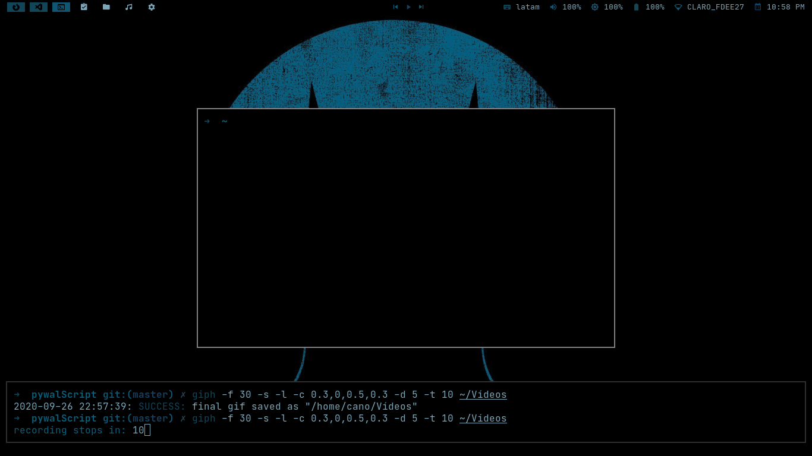

# PywalScript
Es un script desarrollado para la distribución ARCHCRAFT con bspwm o usuarios de Arch que utilicén dichos dotfiles con bspwm, este script genera un esquema de colores utilizando pywal y lo setea a polybar, rofi y la terminal termite.  

  

## Instalar Pywal    
```
sudo pip3 install pywal
```

## Instalación  
```
git clone https://github.com/PAC97/pywalScript.git  
cd pywalScript  
chmod +777 pywalScript  
sudo mv pywalScript /usr/local/bin  
```

## Uso  
```
En tu terminal escribe el siguiente comando:  
pywalScript -i ruta de la imagen  

Ejemplo
pywalScript -i /home/pan/Imágenes/dark.jpg
```

